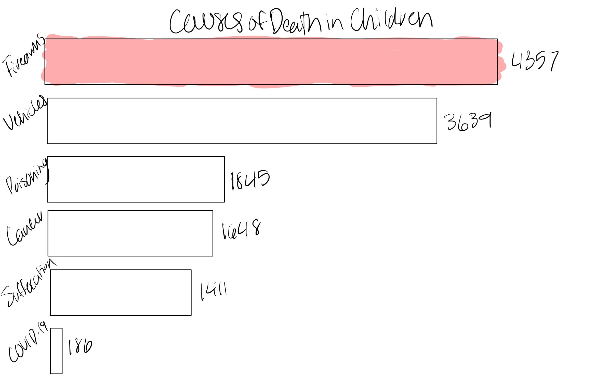
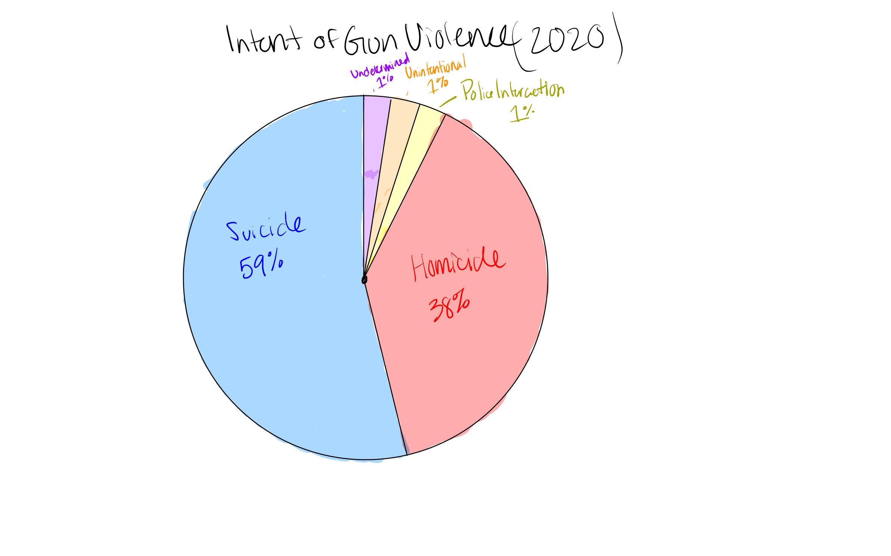

### [BACK TO HOME PAGE](https://github.com/addak1nthomas/portfolio/blob/37671b00852c0404b6255d13770cef0970da2203/README.md)

# Final Project Part 1: Addakin Thomas
I am planning to construct a final project that illustrates the issue of gun violence in the United States, mostly to convince my audience that this is a public health issue. I am planning on attempting to utilize pathos in my final project to appeal to the audience’s emotions as this is a very emotional issue. I will utilize visualizations to show the amount of deaths that occur on a population basis, the reasons in which a firearm was used, and other stories as well.

I will be utilizing publicly accessible data from a variety of sources to tell this story. [Everytown Research](https://everytownresearch.org/report/gun-violence-in-america/) provides great data that depicts a variety of different aspects of gun violence in the United States including the intent in which people use guns. Intent is going to be a big part of my project as it will help contribute to my argument that mental health needs to be more of a priority in order to effectively diminish the negative impact that gun violence has on the United States. I am planning on pulling 2 data sources from the Center for Disease Control and Prevention [[Source 1](https://wonder.cdc.gov/controller/saved/D176/D298F965) & [Source 2](https://wonder.cdc.gov/controller/saved/D76/D262F294)]. 

When it comes for my plan for delivery, I am planning on using shorthand to communicate the story. I like shorthand because it has a storymap feel to it and I find the platform to be engaging. I have a variety of different ideas for visualizations and have received some initial feedback from my peers on how I can improve my approach to depicting the data that I have found. One of my sources from the CDC states that the "crude rate" of gun violence in the United States is 14.8% and I am still trying to figure out what I am planning to do with this statistic. Out of the 329 million people in the United States in 2021, 48,000 of them experienced death because of gun violence, but I want to find more data on how many peoplem are actually affected by gun violence. 

I will also include a map created in GIS that was created using Kernel Density Smoothing on top of a choropleth map. The KDS shows the areas where gun violence is most prevelant and the choropleth map is classified based on the number of policies/laws implemented to help stop gun violence. It will show the reader that places with more policies and laws are experiencing higher rates of gun violence. My goal is to convince the reader that the expansion of mental health resources can help alleviate the top two intents of gun violence; suicide and homicide. Along with this, I will find another data source that shows the types of guns used in gun violence in an attempt to show the prevelance of assault rifles and the impact that could be seen with an assault rifle ban.

### Call to Action
Speak out to local representatives to advocate for mental health to become more of a priority and for a ban on assault rifles. We must fight this issue as a nation and be unified in ending the number 1 cause for pediatric deaths in the United States. 

